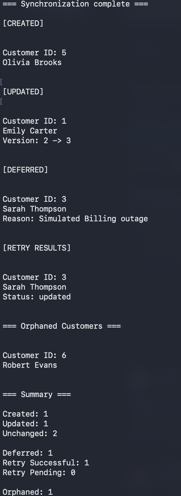
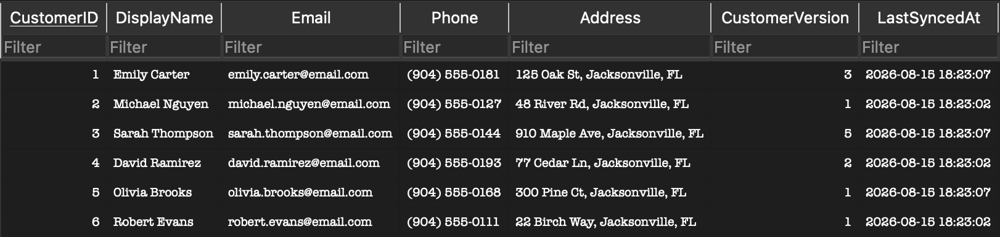

# Cedar Creek Customer Synchronization

## Overview

Cedar Creek is a fictional veterinary practice that is looking to make navigation of their multiple systems more seamless and cohesive. This first project documents a relatively basic process of synchronizing records between two systems, one of which is the owner of the data. 

## System Architecture


## Business Context

Cedar Creek is a relatively new veterinary practice, just expanding to their second clinic location. It has multiple software systems because the business has grown organically over time, and new systems were added as the need arose to transition to a digital format. 

They would prefer to integrate their multiple systems rather than buy one packaged software system because of employee fluency with the current systems and the training and cost incurred when implementing a new system from scratch. Also, their specialized systems include specific functions that they worry might be difficult for a general software system to replicate. 

## Existing Systems

| System | Primary Responsibility | Primary Users | Source of Truth | Synchronizes With |
|--------|------------------------|---------------|-----------------|-------------------|
| Customer Management | Customer contact information | Reception | Customer Data | Billing, Patient Records, Appointment Scheduling |
| Patient Records | Medical histories | Veterinarians | Medical Records | Customer Management |
| Appointment Scheduling | Appointments and schedules | Reception | Appointment Data | Customer Management |
| Billing | Invoices and payments | Billing Staff | Financial Records | Customer Management |

## Project Scope

Although several systems exist within Cedar Creek, this project focuses exclusively on the synchronization of customer information between Customer Management and Billing. The remaining systems provide business context and become the focus of later projects in this portfolio.

## Problem Statement

The current multiple system architecture means that each system that requires customer data is too independent and requires manual input for each customer. This is an issue when a customer needs to change contact information or other customer information, because the receptionists need to input the change in multiple systems. 

The risk is that sometimes our receptionists forget to change information across all the required systems, leaving one system with outdated or incorrect information. A successful resolution to this problem would mean that, when information is added or updated to the customer management system, the billing system updates with that new information automatically.

## Data Ownership

Customer-facing fields like their unique identifier, name, email, phone, address, etc. should all be owned by the Customer Management system. Billing-owned fields are things like invoice amount, balance, payment status, autopay settings, and payment settings. 

Billing can hold customer name and contact information as a local copy. Any discrepancies between these values and the matching ones in the Customer Management system can be resolved with the values from the Customer Management system taking precedence. Billing should never be able to edit customer-facing fields. Any changes should originate from Customer Management. 

This separation of ownership is defined so that discrepancies can be handled predictably and internally, automating the process of updating customer records. 

## Synchronization Strategy

Say, for example, a customer needs to change their phone number. The receptionist changes the information in the Customer Management system. When customer information changes within the Customer Management system, the synchronization process compares the customer's current version against the version stored in Billing. If the source version is newer, the Billing record is updated. New customers are created automatically, unchanged records are skipped, and orphaned Billing records are identified for administrative review.

To demonstrate resilience, the project also includes a configurable simulated outage. Synchronization attempts that fail during the outage are placed into a deferred retry queue and automatically processed once communication is restored.

Exceptional Cases:
If the same update arrives twice, it can be treated as a duplicate and not reapplied.
If an older update arrives after a new one and the field(s) changed are the same, we will keep the newer version's information.
If billing is temporarily unavailable, the queue will be populated with updates to be implemented once it comes back available.
Failed updates can be put into a deferred queue to be retried and reconciled. 

Synchronization will be considered successful if the system can run most changes on its own without needing manual input or troubleshooting outside of extremely exceptional cases.

## Implementation Status

- ✅ SQLite databases created to simulate Customer Management and Billing systems
- ✅ Repeatable seed script for deterministic testing
- ✅ Customer synchronization with whole-record version comparison
- ✅ Field mapping between source and destination systems
- ✅ Duplicate and stale update handling through version checks
- ✅ Structured synchronization logging
- ✅ Deferred retry queue for simulated temporary outages
- ⏳ API-based communication (planned for Project 3)

## Repository Structure

- src/ is code
- data/ contains databases and sample data
- diagrams/ contains project visualizations that could be distributed to internal team members or customer employees
- docs/ contains design notes, implementation decisions, and observations gathered during development
- README explains project scope and purpose

## Running the Project

### Prerequisites
 
 - Python 3.10+
 - DB Browser for SQLite (recommended for inspecting the databases)
 - Git (optional, for cloning the repository)

1. Clone this repository. 
2. Navigate to the project source directory.
3. Seed both databases with sample data:
    
    **macOS / Linux**

    ```bash
    python3 seed_data.py
    ```
    
    **Windows**

    ```powershell
    python seed_data.py
    ```

4. Run the synchronization:
    
    **macOS / Linux**

    ```bash
    python3 seed_data.py
    ```
    
    **Windows**

    ```powershell
    python seed_data.py
    ```

### Expected Output

<p align="center">
  
</p>

After execution, open 'Billing.db' in DB Browser for SQLite to verify that:


- Emily Carter's phone number has been updated
- Sarah Thompson's email has been updated
- Olivia Brooks has been added
- Robert Evans remains as an orphaned record
- 'LastSyncedAt' has been updated for synchronized records

### Simulating an Outage

The synchronization engine includes an optional outage simulation for demonstrating deferred retry behavior.

Within `sync_customers.py`:

```python
SIMULATE_OUTAGE = True
```

When enabled:

- Customer ID 3 is intentionally deferred during the initial synchronization pass.
- The deferred queue is automatically retried once the simulated outage ends.
- The console report displays deferred and retry activity.

Setting the value to `False` disables the simulation and performs a normal synchronization.

## Current Limitations

- Synchronization currently uses whole-record versioning rather than field-level version tracking.
- Orphaned records are reported for administrative review but are not automatically archived or removed.
- Communication between systems is simulated locally using SQLite before introducing API-based integration.
- The retry queue is demonstrated through configurable outage simulation rather than external messaging infrastructure.